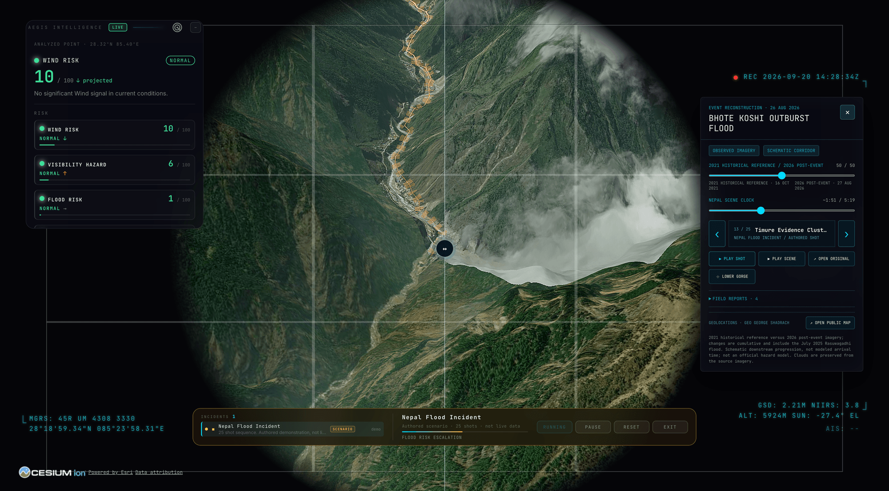

<div align="center">

# 🛡️ AEGIS

### Personal real-time disaster intelligence

**Aegis watches the world so you don't have to.** It knows where you are, what is
happening near you, and — this is the part that matters — what is worth
interrupting you about.



<sub>Incident reconstruction of the Bhote Koshi outburst flood (26 Aug 2026), with live
wind, visibility and flood risk scored for the analyzed point. Note the `SCENARIO`
badge and *"authored scenario · not live data"* on the incident row — a reconstruction
can never be mistaken for an observation. Imagery: Vantor / GeoPera (CC BY-NC 4.0);
basemap © Cesium ion / Esri.</sub>

</div>

---

## What it is

Most disaster maps are passive. They show you every earthquake on Earth and leave
you to work out whether any of them concern you.

Aegis inverts that. It monitors live feeds continuously, scores every event
against **your** location, and speaks up only when something crosses a threshold
that actually matters. When nothing is happening, it stays quiet — and the quiet
is the information.

```
REAL FEEDS → NORMALIZE → GEO-RELEVANCE → PRIORITY → VOICE + MAP + TRANSCRIPT
```

Everything it says is generated from structured data by deterministic templates.
**There is no language model in the alerting path**, and nothing it reports is
invented.

---

## What it does

**Knows where you are, separately from where you're looking.**
Two location contexts, never conflated. *Device location* anchors your personal
alerts; *viewed location* follows the camera. Pan to Nepal and the map panels
follow you there, while your alerts stay pointed at home. The status chip shows
both.

**Decides what matters.**
Every event is scored on distance, severity, recency and provenance, then banded:
`LOCAL` ≤ 50 km · `NEARBY` ≤ 250 km · `REGIONAL` ≤ 1000 km · `GLOBAL` beyond.
Distance dominates — severity alone never earns an interruption. An M5.1 at
6,600 km stays silent; an M6.2 at 58 km speaks.

**Speaks, unprompted.**
When something qualifies, Aegis says so. One voice, one queue — lines are read in
turn, an official warning jumps ahead of routine updates, and a burst of twenty
aftershocks becomes *one* sentence about increasing activity rather than twenty
announcements.

**Explains anything you click.**
Click an earthquake and it briefs you on that event: magnitude, depth, time,
review status, tsunami flag, felt reports — every clause from a field the
provider actually published, and omitted when it wasn't.

**Keeps a live transcript.**
`AEGIS LIVE` records what you've been told this session. Click any line to open
the incident. Session-only by design: it answers "what has Aegis told me while
I've been watching", and no more.

---

## The rules it will not break

These are enforced by tests, not convention:

| Distinction | Why it matters |
|---|---|
| `● OBSERVED` vs `◇ MODEL` vs `▲ OFFICIAL` | A model score is not an event. Only an authority's own warning can reach `URGENT`. |
| Thermal anomaly ≠ wildfire | FIRMS detects heat. Gas flares and sun-warmed ground appear in the feed too. |
| Absence of records ≠ safety | "No incidents recorded within 50 km" is a statement about data, never an all-clear. |
| Flag absent ≠ no hazard | "USGS has not set a tsunami flag" — not "there will be no tsunami". |
| `◼ SCENARIO` vs live | Authored reconstructions can never be mistaken for observations. |

Aegis never tells you that you are in danger, never says "evacuate" or "stay
indoors", and never turns a probability into a prediction. No input it receives
could justify it.

**Your location stays yours.** The exact GPS fix never leaves the module that
receives it — it's rounded to ~1 km immediately, and only the coarse position is
used for distance, geocoding and camera framing. Nothing is written to a URL, a
log or analytics. The closest the camera will ever frame you is city scale.

---

## Incident reconstruction

Aegis can replay an incident as an authored sequence over real terrain — the
screenshot above is the **Bhote Koshi outburst flood** of 26 August 2026, stepped
through 25 shots along the gorge with 2021 historical imagery cross-faded against
2026 post-event imagery.

It is scaffolding for understanding an event, and it is labelled as such
everywhere it appears:

- the incident row carries a `SCENARIO` badge and the words *authored scenario ·
  not live data*
- the status chip switches from `MONITORING` to `SCENARIO` while it plays
- scenario events never enter live incident counts and never trigger a real
  voice alert
- the panel states its own limits: *"schematic downstream progression, not
  modeled arrival time; not an official hazard model"*

The risk panel beside it stays live throughout, scoring the analyzed point from
real Open-Meteo conditions. Reconstruction and observation sit side by side
without ever being confused for one another.

---

## Quick start

No API key needed to boot — Aegis runs on keyless imagery and public feeds.

```bash
git clone https://github.com/hharshhsaini/Aegis.git
cd Aegis
npm install
npm run dev
```

Open **http://127.0.0.1:4173**

> Use `127.0.0.1`, not `localhost`. On dual-stack macOS, `localhost` can resolve
> to IPv6 `::1` while the dev server binds IPv4, which Chrome reports as
> `ERR_CONNECTION_REFUSED`.

Optional keys (Google Maps photorealistic 3D, Cesium ion, OpenSky, OpenAI voice)
go in `.env` — copy `.env.example` and fill in what you want. **Every key is
read server-side only and never reaches the browser.**

```bash
cp .env.example .env
```

---

## Data sources

| Hazard | Source | Nature |
|---|---|---|
| Earthquakes | USGS real-time GeoJSON | Observed |
| Fires | NASA FIRMS (VIIRS NRT) | Observed — thermal anomaly |
| Weather / flood | Open-Meteo | Forecast + model |
| Geocoding | OpenStreetMap / Nominatim | Reference |
| Official warnings | *not configured* | Authority |

**Official alerts are deliberately unimplemented.** India's NDMA operates SACHET
and its alerting is CAP-based, but Aegis has no credentialed, documented public
endpoint wired up — and attaching an authority's name to data it never served
would be worse than having no warnings at all. The provider seam exists and
reports `NOT CONFIGURED`; briefings say so out loud rather than letting you
assume warnings are being watched.

Full per-source licensing and attribution: [DATA_SOURCES.md](DATA_SOURCES.md).

---

## The rest of the globe

Aegis inherits a full spatial-intelligence platform from its upstream project,
and all of it still works underneath the disaster layer.

Fifteen layers and map sources. **Thirteen have a keyless path.** Some offer additional capabilities with a provider key. (🟢 no key · 🟡 free key · 🔴 metered.)

Live aircraft, ships, satellites, public transit, traffic, radio and street
cameras, plus photorealistic 3D terrain. Two details worth knowing:

- **Sits on the real ground.** Entity heights are aligned to work with Google 3D tiles, so aircraft park on aprons and cameras stand on street corners instead of floating.
- **✍️ Annotate it yourself** — DISPLAY ▸ **Draw**: pick Area, Line or Pin, click the vertices on the real world, double-click to finish, label it. Shapes persist with your session.

Public transit feeds are used as open realtime vehicle data, published for
developer use and not against their use. See [DATA_SOURCES.md](DATA_SOURCES.md)
for per-source attribution.

---

## Architecture

Vanilla JS + [CesiumJS](https://cesium.com/platform/cesiumjs/) + Vite. No
framework.

```
src/alerts/       relevance, announcer, voice queue, briefings, event focus
src/incidents/    the one IntelligenceEvent model everything shares
src/app/          assembly — device location, local intelligence, overlays
src/layers/       per-hazard engines (earthquakes, fires, weather)
src/ui/           panels, live feed, startup sequence
server/providers/ local API proxies — every credential stays here
```

One event object drives the map marker, the panel, the transcript and the voice.
Not four copies that can disagree.

Docs: [LOCAL-INTELLIGENCE.md](docs/LOCAL-INTELLIGENCE.md) ·
[FIRE-INTELLIGENCE.md](docs/FIRE-INTELLIGENCE.md) ·
[SEISMIC-FORECASTING.md](docs/SEISMIC-FORECASTING.md) ·
[WEATHER-INTELLIGENCE.md](docs/WEATHER-INTELLIGENCE.md)

---

## Development

```bash
npm test                  # ~4,500 tests
npm run build
npm run format:check
npm run check:boundaries
```

All four must stay green. See [CONTRIBUTING.md](CONTRIBUTING.md).

---

## Credits & licence

Aegis is a derivative work built on
**[God's Eye View](https://github.com/bilawalsidhu/gods-eye-view)** by
[Bilawal Sidhu](https://github.com/bilawalsidhu) and Sameh Khamis — an
MIT-licensed open-source 3D globe platform. The globe, layer architecture,
voice infrastructure and much of the rendering stack come from that project.
Aegis builds the disaster-intelligence layer on top.

Licensed under the [MIT Licence](LICENSE), which covers **source code only**.

⚠️ **Bundled datasets are not MIT.** Several carry NonCommercial or ShareAlike
terms — TeleGeography submarine cables (CC BY-NC-SA 3.0), OSM extracts (ODbL
1.0), Bhote Koshi imagery (CC BY-NC 4.0). If you intend to use Aegis
commercially, read [LICENSE](LICENSE) and [DATA_SOURCES.md](DATA_SOURCES.md) and
remove any dataset whose terms don't fit.

---

<div align="center">

**Aegis is watching.**

</div>
